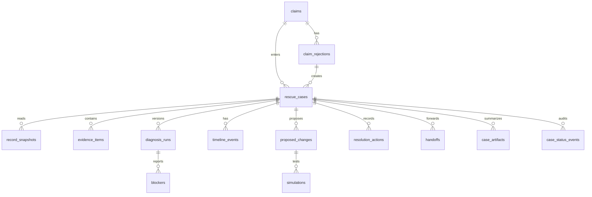

# Nidhi Rakshak — Shared Integration Contract

**Status:** Frozen preparation contract v1 · **Base:** `main` · **Scope:** P0 hackathon prototype

Both developers read this file before touching feature code. It is the source of truth for cross-domain names, state, database boundaries, fixtures, and integration. Member copy must follow `docs/PRD.md`, `docs/journeys.md`, and `docs/DESIGN.md`; internal enum names below are not primary UI language.

## Shared principle

**A owns diagnosis. B consumes diagnosis and owns resolution.** A may produce a new diagnosis version after re-check; B never derives or overwrites the verdict.

## Identifiers and enums

All persisted IDs are PostgreSQL UUIDs. External/demo IDs are stable strings only in fixtures (`case-golden-*`). Shared enums are defined in `src/domain/contracts.ts` and mirrored in `src/db/schema.ts`.

```ts
type JourneyType = "MISMATCH" | "MISSING_DATA" | "VALIDATION_FAILURE" | "SERVICE_HISTORY" | "ELIGIBILITY" | "RECORD_CONSOLIDATION" | "PENDING_PROCESS" | "UNSUPPORTED";
type Verdict = "FIX" | "FIGHT" | "FORWARD" | "NONE";
type OwnerType = "MEMBER" | "EMPLOYER" | "EPFO" | "BANK" | "NONE";
type DiagnosisStatus = "DIAGNOSED" | "NEEDS_EVIDENCE" | "UNSUPPORTED";
type EvidenceState = "SUFFICIENT" | "INSUFFICIENT" | "CONTRADICTORY" | "UNKNOWN";
type SupportStatus = "GOLDEN" | "SUPPORTED" | "DECLARED_UNSUPPORTED";
type CaseStatus = "OPEN" | "DIAGNOSING" | "DIAGNOSED" | "IN_RESOLUTION" | "WAITING" | "RESOLVED" | "REFUSED";
type RouteType = "MEMBER_CORRECTION" | "EPFO" | "EMPLOYER" | "BANK" | "WAIT" | "NONE";
```

Future `BENEFICIARY_SUCCESSION` is intentionally absent from the P0 union.

## DiagnosisResult v1

The exact Zod schema is `src/domain/contracts.ts`. A produces this shape; B imports the schema/type and consumes only validated results.

```ts
type DiagnosisResult = {
  contractVersion: "1"; caseId: string; diagnosisId: string; rejectionCode: string;
  journeyType: JourneyType; status: DiagnosisStatus; supportStatus: SupportStatus;
  problemSummary: string;
  blocker?: { type: string; field?: string; reason: string };
  owner: OwnerType; verdict?: Verdict;
  doNotTouch: { applies: boolean; reason?: string };
  evidenceState: EvidenceState; evidence: EvidenceSummary[];
  firstDivergence?: { label: string; source: string; detail: string };
  falsifier?: string; nextRouteType: RouteType; recommendedAction: string;
  version: number;
}
```

Finalized diagnosis rows are append-only. A re-check creates `version + 1`; the prior result remains readable. `UNSUPPORTED` and `NEEDS_EVIDENCE` may omit verdict. Multiple blockers are represented by multiple A-owned `blockers` rows; the contract exposes the primary blocker and summary evidence for B.

## Error, analytics, and HTTP conventions

JSON responses use `{ data }` on success and `{ error: { code, message, retryable, requestId } }` on failure. Inputs are Zod-validated at route boundaries. `POST` actions accept an `Idempotency-Key`; duplicate keys return the original result. Analytics names are lower-case snake case and always include `caseId` when available: `claim_rescue_opened`, `rejection_decoded`, `journey_type_selected`, `evidence_requested`, `diagnosis_refused`, `sandbox_started`, `sandbox_completed`, `resolution_started`, `handoff_created`, `receipt_created`, `case_rechecked`, `blocker_resolved`.

## Golden fixtures

Stable IDs are exported from `src/domain/golden-fixtures.ts`: `GOLDEN_FIGHT_RELATION_NAME`, `GOLDEN_FORWARD_EXIT_DATE`, `GOLDEN_FIX_BANK`, `GOLDEN_UNSUPPORTED`. They are hand-authored, deterministic, validated in tests, and must not be changed to make an implementation pass.

## Ownership matrix

| Surface | Owner | Read access | Write access |
|---|---|---|---|
| `src/domain/contracts.ts`, schema enums, app shell, env, package scripts | SHARED_READ_ONLY after base | A/B | integration only |
| `src/domain/golden-fixtures.ts` and contract tests | SHARED_READ_ONLY | A/B | integration only |
| `features/claim-intelligence/**`, diagnosis routes/services | A_OWNED | A; B contract-only | A |
| `features/resolution-recovery/**`, resolution routes/services | B_OWNED | B; A read-only | B |
| `claims`, `claim_rejections`, `rescue_cases`, `rejection_contracts`, `record_snapshots`, `evidence_items`, `diagnosis_runs`, `blockers`, `timeline_events` | A_OWNED | B read-only | A |
| `proposed_changes`, `simulations`, `resolution_actions`, `handoffs`, `case_artifacts`, `case_status_events` | B_OWNED | A read-only | B |
| `app/layout.tsx`, `src/db/index.ts`, migrations, lockfile, global CSS, route registry, analytics bootstrap | INTEGRATION_ONLY | A/B | integration owner only |
| `scripts/seed.ts`, scenario factories, seed verification | SHARED_READ_ONLY | A/B | integration owner until schema/fixtures change |

**Must not edit:** each developer must not edit the other domain, shared contract/schema, root layout, package manifest/lockfile, migrations, or global styling in a normal feature session. A required shared change stops work, increments the contract version if breaking, gets a small integration commit, and is synced to both branches.

## Database contract

The schema is in `src/db/schema.ts`; the generated SQL migration is under `drizzle/`. Canonical state lives in claims/cases and current resolution rows. Evidence, diagnosis, and status event records preserve provenance/history. Delete cascades are limited to child evidence/timeline/status rows; diagnosis and resolution history use restrict semantics. Feature branches do not add migrations for P0.



Table-level field/type/constraint details are captured in `docs/architecture.md` and the Drizzle schema; the implementation session must not invent new shared tables.

## Fixture adapter

`src/domain/fixture-provider.ts` exposes validated golden `DiagnosisResult` values. B starts with it and swaps only the provider at I1; no resolution UI/API should depend on A's internal tables or implementation.

## Build and integration protocol

Prepared base is one shared `main` SHA. Tomorrow create `feat/claim-intelligence` and `feat/resolution-recovery` from it. Create `integration` only when merging. Merge shared/base (already present), A diagnosis API/data, B resolution domain, then connect B from fixture to A's validated provider.

- **I1 Contract integration:** real A response passes the same Zod contract and replaces B's fixture provider without UI rewrite.
- **I2 Golden loops:** Fight, Forward, Fix, Unsupported end-to-end, including receipt/tracking/re-check where applicable.
- **I3 Ship gate:** deterministic seed/verify, migrations, contract/unit/integration/E2E tests, lint, typecheck, build, manual demo.

Rebase only at session boundaries or before I1; do not cherry-pick feature commits casually. Conflict resolution is owned by the integration driver, who may change protected files only in a dedicated integration commit.

## Mock population contract

The intended population is 500 deterministic claim cases with seed `20260828`, distributed 40 golden variants, 100 mismatch, 80 missing data, 70 validation failure, 70 service history, 50 eligibility, 30 consolidation, 30 pending, 30 unsupported/contradictory/insufficient. No real PII or plausible live identifiers. The current foundation verifies golden fixtures and prints the deterministic population plan; relational insertion is deliberately a later schema-backed implementation task, never a pre-schema shortcut.

## Deployment and database provider

Vercel is the intended Next.js deployment target and Supabase is the intended hosted Postgres target. Keep `DATABASE_URL`, `NODE_ENV`, and `NIDHI_FIXTURE_MODE` in Vercel environment variables; never commit credentials. Local development may use the Supabase project or a local Postgres URL with the same migration. Provider setup is external to this checkout, so the implementation owner must verify the assigned project connection before applying the migration.

## Contract change protocol

Breaking shared enum, ID, schema, route, error, analytics, or DiagnosisResult changes require: stop; update this document and `contractVersion`; update contract tests; make one integration/main commit; sync both worktrees; resume. A cannot mutate resolution state and B cannot recompute or persist verdict logic.
