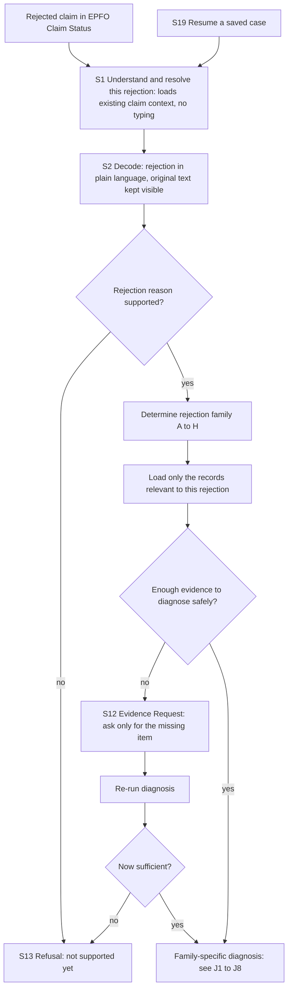
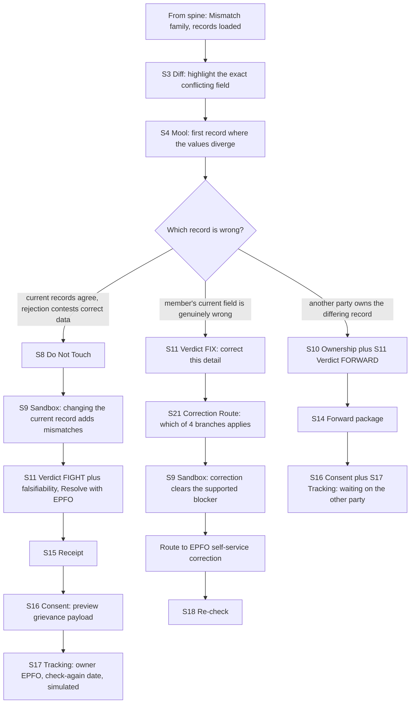
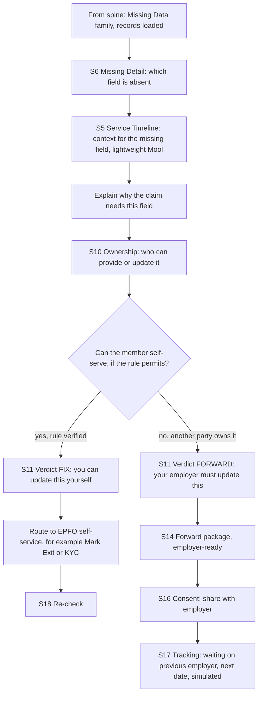
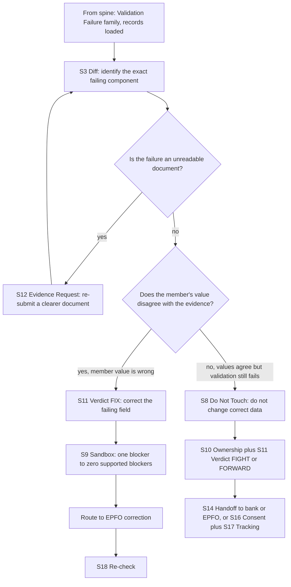
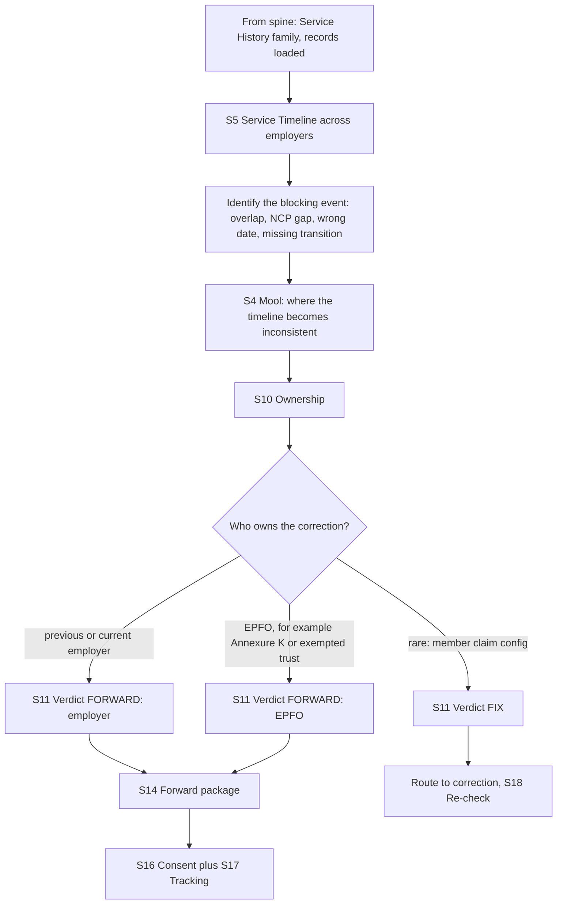
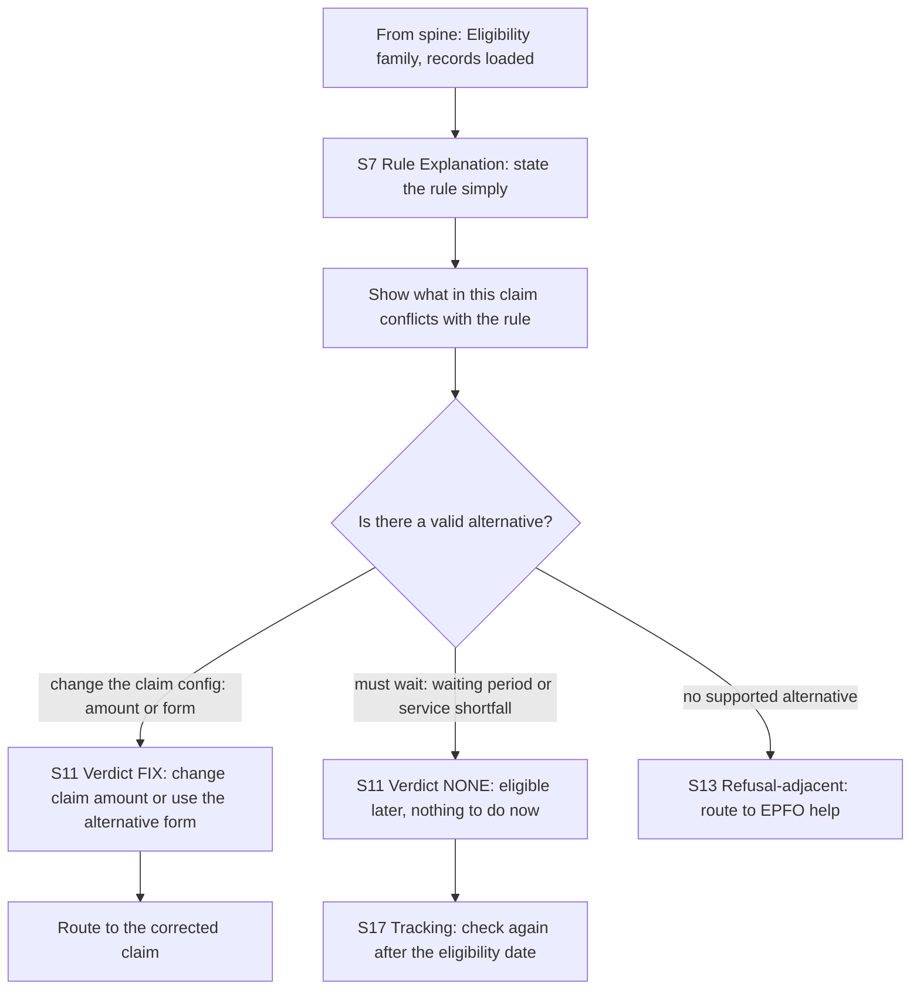
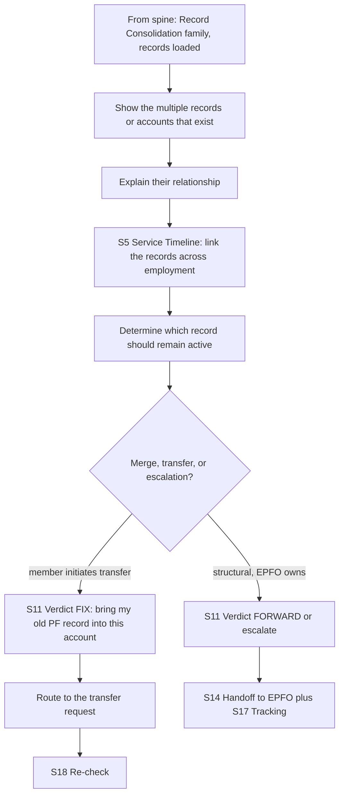
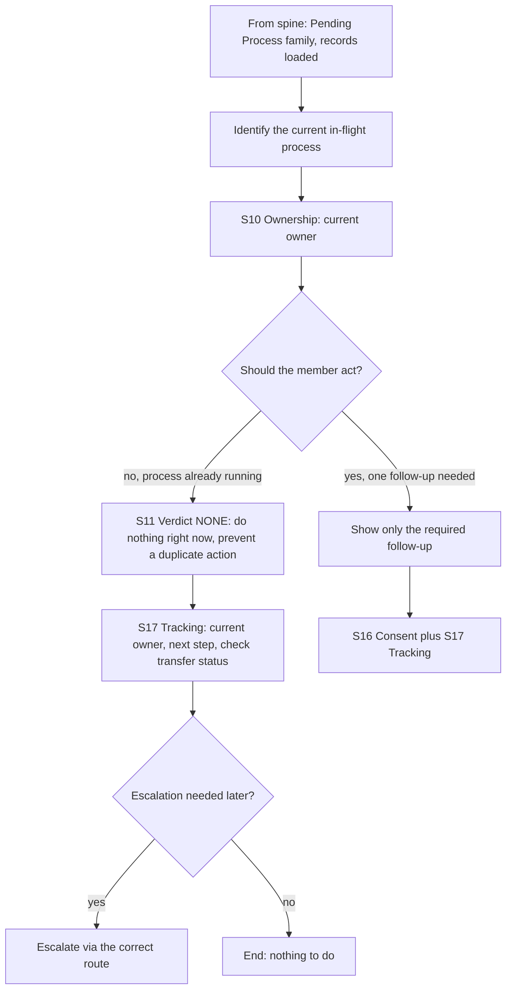
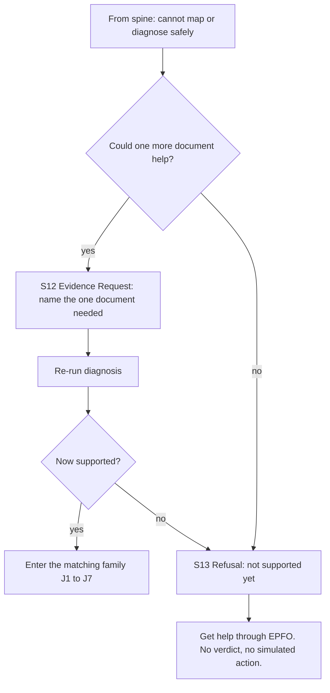
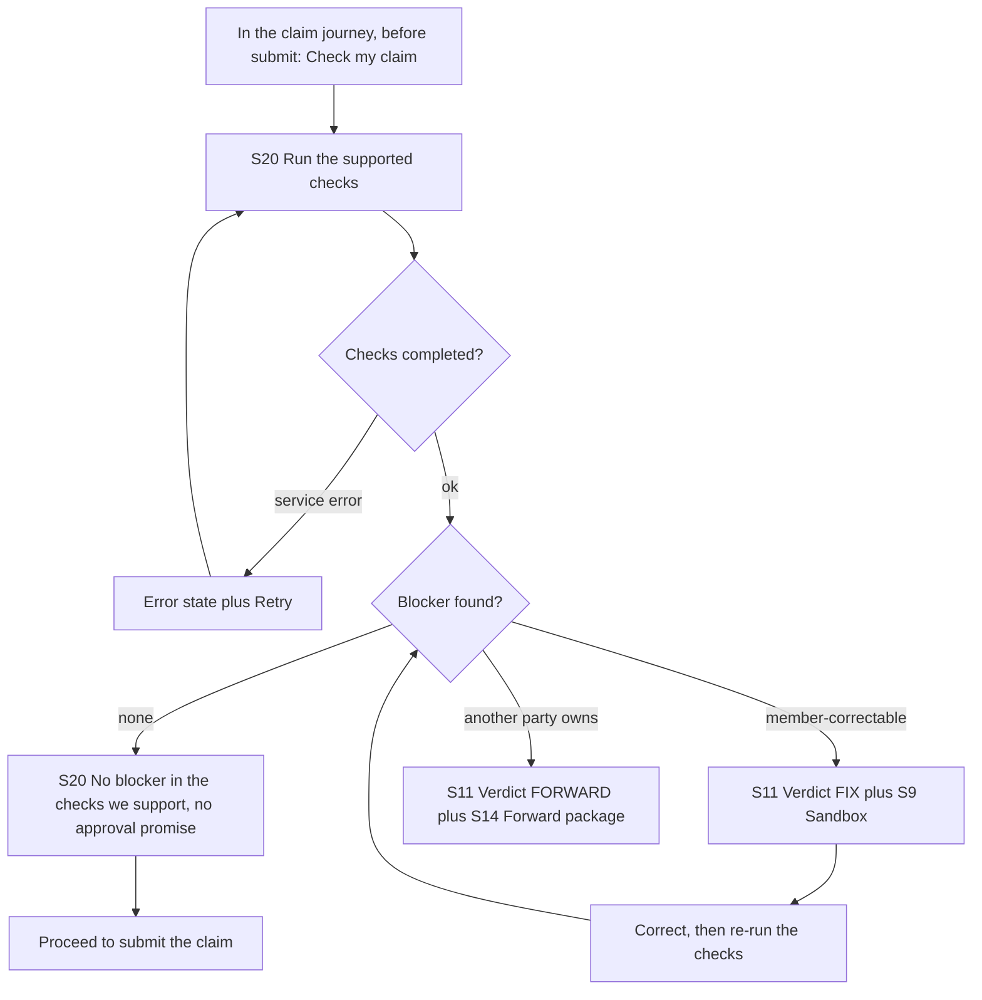

# Nidhi Rakshak — User Journeys

Source PRD: PRD.md (updated 2026-08-27, reflects Rejection Taxonomy v2)

This doc is decomposed by the PRD's eight journey families (§9), each at equal depth. The member's underlying problem picks the family; the Fix / Fight / Forward verdict runs afterwards and shows up as an inline branch inside the family, because the same family can end in different verdicts for different members. The four hackathon golden cases (Fight, Forward, Fix, Refusal) are called out as concrete instances inside their families, not as separate journeys.

Entry is context-first, per PRD Principle #1. The member never has to screenshot, photograph, or retype the rejection. The product opens against an already-rejected claim and reads the claim context EPFO already holds. Camera and upload survive only inside the Missing Evidence sub-flow (§17), when the records on hand genuinely cannot settle the diagnosis.

Every screen carries a persistent "Simulated prototype, not EPFO" label. Progress is saved per case, so any journey can be re-entered and resumed from the last completed step (S19).

## Personas

**Rejected member (primary).** An EPFO member whose withdrawal or transfer claim has already been rejected and who cannot tell, on their own, what the rejection means, whose fault it is, or what to do next. We design for the harder context first: limited EPFO familiarity, Hindi or code-mixed language preference, a cheaper or older phone, dependence on family or a cyber-cafe helper, and low confidence about which of their records is actually correct. The design also has to work for a digitally confident white-collar member. They want their money released, not an EPFO education.

**Receiving actors (secondary, not app users).** Previous employer, current employer, HR or payroll, bank, and EPFO itself. A Forward verdict routes to one of these. They never open Nidhi Rakshak, but they consume the Forward package, so it is written for them to act without re-diagnosing anything.

**Trusted helper (secondary, out of this pass).** A relative, friend, or cyber-cafe operator working on the member's behalf. Helper mode is P1/P2 and gets no dedicated journey here. Named only so the receipt and handoff artifacts stay legible to a second reader. Member consent still gates every consequential action.

## Journeys

Nine end-to-end sessions. J1 to J8 are the eight journey families; a given rejected claim runs through exactly one of them. J9 is the P1 pre-filing surface that runs the same supported checks one step earlier. Golden cases: J1 carries golden Fight, J2 carries golden Forward, J3 carries golden Fix, J8 carries golden Refusal.

### Shared diagnosis spine

Every supported rejection runs the same front-half before it reaches a family. It is described once here; each family journey below begins from the divergence point rather than repeating it.

Shared rules for the spine: no login gate in the prototype; the rejection is never re-entered by the member; the evidence gate asks for a document only when it can change the diagnosis; an unsupported reason or an unresolvable evidence gap always exits to Refusal (S13), never to a guess.

---

### J1 — Mismatch (which value is actually wrong?)

**Family:** A. **User question:** which of my records is wrong, and should I even change it? **Entry points:** shared spine, family = Mismatch. Covers name, DOB, gender, and relation-name mismatches. Taxonomy v2 marks these codes FORK: the engine resolves to Fix, Fight, or Forward per the records, and the member still only sees plain action language. **Golden case:** Fight (relation / name mismatch) lives here.

**Steps:**

1. **Diff (S3).** Show the conflicting records side by side, differing characters highlighted, each value tagged with its source and its verified / simulated / inferred state.
2. **Mool (S4).** Show the first observable point where the records stop agreeing, for example an older 2019 PF record. Verified and inferred are kept visually distinct. Mool names the first divergence, never a culprit, unless a write event is actually in evidence.
3. **Decide which record acts (verdict engine, deterministic).** Three branches.
4. **Fight branch (golden).** Current records (Aadhaar, PAN, current PF) agree and the rejection is contesting correct data. Show Do Not Touch (S8) louder than the rest of the screen, then Sandbox (S7/S9) proving that changing the current name raises mismatches from one to two. Verdict FIGHT (S11): keep your details, resolve with EPFO. If the member insists on correcting the past record anyway, the Correction Route (S21) shows which of the four branches applies and why the other three do not. Produce a Receipt (S15), gate the grievance payload behind Consent (S16), then Tracking (S17).
5. **Fix branch.** The member's current field is the wrong one and the evidence supports the corrected value. Verdict FIX (S11), Correction Route (S21) to pick the branch, Sandbox showing one blocker going to zero, route into the existing EPFO correction flow, then Re-check (S18).
6. **Forward branch.** The differing record is one the member does not control. Ownership (S10) names the owner, verdict FORWARD (S11), Forward package (S14), Consent and Tracking.

**Exit states:** Fight ends at Tracking with a contest route and a shareable receipt. Fix ends in the EPFO correction flow, sandbox-validated. Forward ends with a forwardable package plus a tracker. Insufficient evidence at any point exits to Refusal (S13). All progress is saved and resumable.

---

### J2 — Missing Data (what is missing and who adds it?)

**Family:** B. **User question:** what information is missing, and who needs to add it? **Entry points:** shared spine, family = Missing Data. Covers Aadhaar not seeded, UAN not activated, mobile not linked, exit date missing, and purpose-document missing. **Golden case:** Forward (Date of Exit missing, employer-owned) lives here; Taxonomy v2 verdict is FORK (Fix via Mark Exit if eligible, else Forward).

**Steps:**

1. **Missing Detail (S6).** Name the absent field plainly, for example "your Date of Exit is missing from your PF record."
2. **Timeline (S5).** Give lightweight chronological context so the member sees where the field belongs. Mool stays lightweight here; the point is what is missing, not who diverged.
3. **Why it matters.** One line on why the claim cannot proceed without it.
4. **Ownership (S10).** Decide who can provide the field, via the Correction Route (S21) inputs. For Date of Exit the rule is now verified (Taxonomy v2): the member can self-serve via Mark Exit only if two months have elapsed since the last PF contribution received and the UAN is Aadhaar-verified, with the exit date falling within the month of the last contribution. The engine reads the last contribution month, not a member-stated last working day. Otherwise the employer owns it. The one item still open is whether Jan-2025 self-service reaches past member-ID records (§44 item 4); the Correction Route defaults to the safe employer branch until it is confirmed, so it does not block.
5. **Fix branch.** If the member is legally able to self-serve, verdict FIX (S11): update it yourself, route to the correct EPFO flow, Re-check (S18).
6. **Forward branch (golden).** If another party owns it, verdict FORWARD (S11). Generate an employer-ready Forward package (S14) carrying member, blocking field, current state, requested action, last contribution, and the simulation label. Consent (S16) before sharing, then Tracking (S17): waiting on the previous employer, with a next date that is labelled simulated unless a real rule supports it.

**Exit states:** Fix ends in the correct self-service flow; Forward ends with a complete package and a tracker showing the employer owns the blocker. Refusal if the missing field cannot be established. Saved and resumable.

---

### J3 — Validation Failure (it looks correct, so why does it fail?)

**Family:** C. **User question:** my detail looks correct, so why is it still failing? **Entry points:** shared spine, family = Validation Failure. Covers signature mismatch, invalid or obsolete bank details, non-spouse-joint or deposit-capped or dormant accounts, bank validation failure, and unreadable documents. Spouse-joint accounts are permitted (Taxonomy v2), so they never trigger this family. **Golden case:** Fix (invalid bank detail) lives here.

**Steps:**

1. **Diff (S3).** Point at the exact failing component, for example the account number or IFSC, and compare it to the document available where a comparison exists.
2. **Unreadable-document branch.** Largely obsolete since the 3 April 2025 circular, because document upload is no longer required for online claims when the account passes validation. If a legacy path still needs a readable document, ask for a clearer copy via Evidence Request (S12), then re-run. This is the only place camera or upload appears in this family.
3. **Fix branch (golden).** If the member's entered value genuinely disagrees with the evidence, verdict FIX (S11): correct the failing field. Sandbox (S9) shows the supported blocker count going from one to zero, phrased as "correcting this clears the blocker we found," never as "your claim will be approved." Route into the EPFO correction flow, then Re-check (S18).
4. **Fight / Forward branch.** If the entered value already matches the evidence and validation still fails, the system must not tell the member to change correct data. Do Not Touch (S8), Ownership (S10), and either FIGHT (escalate) or FORWARD (bank must verify, for example a dormant account). Handoff (S14) or Consent plus Tracking as the route requires.

**Exit states:** Fix ends in the correction flow, sandbox-validated. Fight or Forward ends with an escalation or bank handoff plus a tracker. Unreadable documents loop through Evidence Request until legible or refused. Saved and resumable.

---

### J4 — Service History (what across my jobs is blocking this?)

**Family:** D. **User question:** what happened across my previous jobs that is blocking this claim? **Entry points:** shared spine, family = Service History. Covers wrong exit or joining dates, service overlap, NCP mismatch, contributions not remitted, Annexure K missing, exempted-trust records, and EPS wage discrepancies.

**Steps:**

1. **Timeline (S5).** Build the employment timeline across employers so the member can see the whole service picture.
2. **Blocking event.** Identify where the timeline breaks: dates overlapping ("your new employment begins before your previous PF record shows you left"), a contribution gap, a missing transfer, or a missing Annexure K.
3. **Mool (S4).** Show where the record first becomes inconsistent, without assigning blame beyond the evidence.
4. **Ownership (S10).** Most service-record issues are owned by an employer or EPFO, not the member. Decide the owner deterministically.
5. **Forward branches.** Employer-owned (exit or join dates, overlap, NCP, remittance) or EPFO-owned (Annexure K, exempted trust). Verdict FORWARD (S11), Forward package (S14) addressed to the right actor, Consent (S16), Tracking (S17).
6. **Fix branch (rare).** Only when the blocking element is genuinely a member-side claim configuration.

**Exit states:** a Forward package addressed to the owning actor plus a tracker; or, rarely, a member correction. EPS wage discrepancy may be specialized enough to exit to Refusal if unsupported. Saved and resumable.

---

### J5 — Eligibility (are my records wrong, or is this claim not allowed?)

**Family:** E. **User question:** are my records wrong, or is this type of claim simply not allowed right now? **Entry points:** shared spine, family = Eligibility. Covers service-length shortfall, amount over cap, waiting period not met, wrong form, and advance limit exhausted. Mool and Diff generally do not appear here; the failure is a rule, not a divergence.

**Steps:**

1. **Rule Explanation (S7).** State the failing rule in plain language, for example "the amount requested is higher than the allowed amount for this purpose." No invented numbers: exact statutory thresholds stay on the cut list (§44) unless verified.
2. **Show the conflict.** Point at what in this claim breaks the rule. Reassure where records are fine: "your details are okay, this is a rule limit, not a record problem."
3. **Alternative branch (Fix).** If a valid alternative exists, verdict FIX (S11): change the claim amount, or file the alternative form. Route to the corrected claim.
4. **Wait branch (None).** If the block is time-based, verdict NONE: nothing to do now, eligible after a date. Tracking (S17) with a check-again date, labelled simulated unless the rule is verified.
5. **No-alternative branch.** If nothing valid exists, route to EPFO help rather than inventing a path.

**Exit states:** a corrected claim, a legitimate wait state with a date, or a routed handoff to EPFO help. This family never tells the member to alter a correct record to satisfy a policy limit. Saved and resumable.

---

### J6 — Record Consolidation (why do I have multiple records?)

**Family:** F. **User question:** why do I have multiple PF or member records, and how do they get connected? **Entry points:** shared spine, family = Record Consolidation. Covers multiple UANs, unmerged Member IDs, duplicate identity structures, and an old PF account not connected to the current one. This is not a simple mismatch: several records for the same person exist independently.

**Steps:**

1. **Show the records.** List the PF membership records or accounts linked to the member, for example "we found two PF membership records linked to you."
2. **Explain the relationship.** State plainly that an older balance has not yet been connected to the current account, without implying fault.
3. **Timeline (S5).** Use the employment timeline to show how the records relate across jobs.
4. **Which stays active.** Determine the record that should remain active and whether a merge, transfer, blocking, or escalation is required.
5. **Fix branch.** If the member can initiate the connection, verdict FIX (S11): bring the old PF record into this account. Route to the transfer request, then Re-check (S18).
6. **Forward / escalate branch.** If the structure needs EPFO to act, verdict FORWARD, Handoff (S14), Tracking (S17).

**Exit states:** a transfer the member initiates, or an EPFO escalation with a tracker. One next action either way. Saved and resumable.

---

### J7 — Pending / Existing Process (is something wrong, or already happening?)

**Family:** G. **User question:** is something actually wrong, or is another process already running? **Entry points:** shared spine, family = Pending / Existing Process. Covers KYC pending approval, transfer already pending, duplicate or already-settled claim, employer approval pending, invalid employer DSC, and existing corrections. The strongest value here is preventing a harmful duplicate action.

**Steps:**

1. **Identify the process.** Name the operation already in flight, for example "your transfer is already being processed."
2. **Ownership (S10).** State the current owner, for example EPFO.
3. **Should the member act?** The key branch.
4. **Do-nothing branch (None).** If a process is already running, verdict NONE: "you do not need to submit another transfer request." This prevents the duplicate action that trial-and-error behaviour produces. Tracking (S17) shows owner and next step. A valid resolution can be doing nothing right now.
5. **Follow-up branch.** If one genuine follow-up is required, show only that, Consent (S16) if it is outbound, Tracking (S17).
6. **Escalate only if necessary.** Surface an escalation route only when the process is genuinely stuck.

**Exit states:** most sessions end in a deliberate do-nothing state with a tracker; some in a single follow-up; escalation only when warranted. Preventing unnecessary action is the win. Saved and resumable.

---

### J8 — Unsupported / Uncertain (system safely refuses)

**Family:** H. **User question:** none, this is where the product admits it cannot safely answer. **Entry points:** shared spine, whenever the rejection cannot be classified or the evidence cannot establish the diagnosis. **Golden case:** Refusal lives here. This is a designed trust path, not an error screen.

**Steps:**

1. **Reach the boundary.** Two triggers: the rejection reason is unsupported (`UNMAPPED_REJECTION`), or the available records cannot establish the diagnosis safely.
2. **Ask, only if useful (S12).** If exactly one document could move the case from unsupported to supported, ask for it and re-run. If it now maps, hand off into the matching family.
3. **Refuse (S13).** Otherwise, say so plainly: "we can't safely diagnose this rejection yet," or "this rejection is not supported by Nidhi Rakshak yet." Route to EPFO help.
4. **Stop.** No verdict, no invented Mool story, no simulated action. The system must not guess because the member reached this point.

**Exit states:** either promotion into a supported family after new evidence, or a clean, explained refusal with a concrete next input. Required demo case: the product must prove it knows when not to answer.

---

### J9 — Pre-flight / Claim Compiler (P1, before filing)

**Persona moment:** the same member, one step earlier, before submission. **Entry points:** inside the claim journey, "Check my claim before submitting." P1 secondary surface, included because it runs the same supported checks earlier in the timeline.

**Steps:**

1. **Invoke.** Before submitting, the member taps "Check my claim before submitting."
2. **Run checks (S20).** Only the supported checks run. Service error shows an error state with Retry.
3. **No blocker.** "We didn't find a blocker in the checks we support." It must not promise approval. The member proceeds to submit.
4. **Fixable blocker.** Route through verdict FIX (S11) and Sandbox (S9), then re-run the checks.
5. **External blocker.** Route to verdict FORWARD (S11) and the Forward package (S14), as in J2 and J4.

**Exit states:** a clean pre-flight and submission, or a blocker fixed or forwarded before filing. The pre-flight never promises approval. Saved and resumable.

## Story Traceability

The PRD is organized by rejection taxonomy, journey families, golden cases, and prioritized features rather than user stories. Every rejection code from the mapping table (§9.9), every P0 feature (§35), every golden case, and the relevant P1 items are traced to the journeys that cover them. No orphans.

**Rejection codes to journey families**

| Rejection code | Journey | Notes |
|---|---|---|
| KYC_NAME_MISMATCH | J1 Mismatch | Mool plus Diff |
| KYC_DOB_MISMATCH | J1 Mismatch | Diff |
| KYC_GENDER_MISMATCH | J1 Mismatch | Diff |
| RELATION_NAME_MISMATCH | J1 Mismatch | Golden Fight; FORK; correction via branch ladder (§8.6) |
| AADHAAR_NOT_SEEDED | J2 Missing Data | KYC route |
| UAN_NOT_ACTIVATED | J2 Missing Data | Activation action |
| MOBILE_NOT_LINKED_AADHAAR | J2 Missing Data | External identity dependency |
| EXIT_DATE_MISSING | J2 Missing Data | Golden Forward; FORK Mark Exit vs employer; Service Timeline |
| PURPOSE_DOCUMENT_MISSING | J2 Missing Data / J5 Eligibility | Evidence Request |
| SIGNATURE_MISMATCH | J3 Validation Failure | Evidence re-submission |
| BANK_DETAILS_INVALID | J3 Validation Failure | Golden Fix; no employer step or upload since Apr 2025 |
| BANK_IFSC_OBSOLETE | J3 Validation Failure | Fix |
| BANK_ACCOUNT_NON_SPOUSE_JOINT | J3 Validation Failure | Non-spouse / third-party only; spouse-joint permitted |
| BANK_DEPOSIT_CAP | J3 Validation Failure | Raise cap or switch account |
| BANK_ACCOUNT_DORMANT | J3 Validation Failure | Fork: reactivate or switch account |
| BANK_VALIDATION_FAILED | J3 Validation Failure | Fight or Forward possible |
| DOC_IMAGE_UNREADABLE | J3 Validation Failure | Largely obsolete; upload not required online |
| EXIT_DATE_WRONG | J4 Service History | Employer ownership |
| DOJ_MISSING_OR_WRONG | J4 Service History | Employer ownership |
| SERVICE_OVERLAP | J4 Service History | Timeline |
| NCP_DAYS_MISMATCH | J4 Service History | Employer ownership |
| CONTRIBUTION_NOT_REMITTED | J4 Service History | Employer or EPFO |
| ANNEXURE_K_MISSING | J4 Service History | EPFO ownership |
| EXEMPTED_TRUST | J4 Service History | External owner |
| EPS_WAGE_DISCREPANCY | J4 Service History | Declared unsupported; employer joint declaration |
| FORM_10C_AFTER_10Y | J5 Eligibility | Alternative form |
| SERVICE_LENGTH_SHORTFALL | J5 Eligibility | Alternative or wait |
| CLAIM_EXCEEDS_CAP | J5 Eligibility | Change claim |
| WAITING_PERIOD_NOT_MET | J5 Eligibility | Wait state |
| ADVANCE_LIMIT_EXHAUSTED | J5 Eligibility | Alternative |
| MULTIPLE_UANS | J6 Record Consolidation | Service history |
| MEMBER_IDS_UNMERGED | J6 Record Consolidation | Transfer |
| KYC_PENDING_APPROVAL | J7 Pending Process | Employer ownership |
| TRANSFER_IN_PENDING | J7 Pending Process | Tracking |
| EMPLOYER_DSC_INVALID | J7 Pending Process | Employer ownership |
| DUPLICATE_OR_SETTLED | J7 Pending Process | Prevent duplicate action |
| UNMAPPED_REJECTION | J8 Unsupported | Golden Refusal |
| NOMINATION_MISSING | none (future) | Beneficiary / Succession, out of scope §9 |

**P0 features to journeys**

| Feature | Journey(s) | Notes |
|---|---|---|
| P0.1 Embedded Claim Entry | Shared spine, all J1–J8 | S1, context-first |
| P0.2 Decode | Shared spine, all J1–J8 | S2 |
| P0.3 Rejection Contract Engine | Underlies family routing, all | Maps code to family, records, verdict, route |
| P0.4 Journey Family Router | The J1–J8 decomposition itself | Family = the member's problem type |
| P0.5 Relevant Record Comparison | J1, J3, J4 | S3 Diff |
| P0.6 Mool | J1, J4, J6 | S4; lightweight in J2 |
| P0.7 Ownership Engine | J2, J3, J4, J6, J7 | S10 |
| P0.8 Do Not Touch | J1, J3 | S8; safety state |
| P0.9 Fix / Fight / Forward | J1, J2, J3, J4, J6, J9 | S11 verdict branches |
| P0.10 Action Translation | All diagnosing journeys | S11 language; taxonomy never shown as instruction |
| P0.11 Falsifiability | J1, J3, J4 | S11 line |
| P0.12 Try Before You Touch | J1, J3, J6, J9 | S9 Sandbox |
| P0.13 Missing Evidence Request | Shared spine, J3, J8 | S12 |
| P0.14 Refusal | J8 (and any J via spine) | S13 |
| P0.15 Case Receipt | J1, J2 (and any diagnosing J) | S15 |
| P0.16 Tracking | J1, J2, J4, J5, J6, J7 | S17 |

**P1 and named items to journeys**

| Item | Journey(s) | Notes |
|---|---|---|
| Pre-flight / Claim Compiler | J9 | S20 |
| Employer-oriented Forward artifact | J2, J4, J6, J9 | S14 |
| Correction route ladder (PRD §8.6) | J1, J2 | S21; picks the correction branch, feeds Try Before You Touch |
| Consent plus simulated execution | J1, J2, J4, J6, J7 | S16 |
| Action re-check | J1, J2, J3, J6, J9 | S18 |
| Tap important text to hear it (audio) | All | Presentation layer over S2–S11; P1, not in golden flow |
| Pre-recorded audio for golden flows | J1, J2, J3, J8 | Demo infrastructure; reduces live-API risk |
| Multilingual / Hindi-first | All | Presentation layer; P1 |
| Persistent case history / resume | All | S19 |
| Golden Case 1 Fight | J1 | Hero |
| Golden Case 2 Forward | J2 | |
| Golden Case 3 Fix | J3 | |
| Golden Case 4 Refusal | J8 | Required demo case |
| Helper mode, IVR / missed-call, WhatsApp, guardian mode, cohort intelligence, nominee / death claims, employer-side prevention | none | Explicitly P2 / future §37; no journey this pass |

## Screen Inventory

Handoff surface for wireframing. Screens follow the PRD's reusable-module model (§10), so most appear across several families and compose dynamically per rejection contract. Every screen also carries the global "Simulated prototype, not EPFO" label.

### S1 — Rejection Entry (context-first)
**Purpose:** open against an already-rejected claim and load the context EPFO already holds. **Appears in:** shared spine, all journeys.
**Contents:** the rejected claim summary, primary CTA "Understand and resolve this rejection," no typing and no camera at this step. The member never re-enters claim ID, UAN, or the rejection text.

| State | Behavior |
|---|---|
| Loading | Fetching claim context |
| Default | Rejected claim summary plus the single CTA |
| Error | Claim context failed to load; Retry |
| Empty (standalone, no context) | If a prototype build has no simulated claim to read, fall back to Evidence Request (S12); not the primary path |

### S2 — Rejection Decode
**Purpose:** turn the rejection into one plain-language explanation. **Appears in:** shared spine, all journeys.
**Contents:** plain-language explanation (English or Hindi where supported), original rejection text kept visible, internal code not shown to the member.

| State | Behavior |
|---|---|
| Loading | Mapping rejection to a supported code |
| Default | Explanation plus original text |
| Unsupported | Reason cannot be classified; route to S13 Refusal |

### S3 — Record Diff
**Purpose:** make the disagreement visually obvious. **Appears in:** J1, J3, J4.
**Contents:** side-by-side sources and values, differing characters highlighted, per-field source, raw and normalized value, verified / simulated / inferred state. CTA "Find where this starts."

| State | Behavior |
|---|---|
| Loading | Fetching and normalizing records |
| Empty | No comparable records; route to S13 Refusal |
| Error | Record fetch failure; Retry |
| Default | Highlighted diff with provenance chips |

### S4 — Mool (first divergence)
**Purpose:** show the first observable point where records diverge, without claiming a culprit. **Appears in:** J1, J4, J6; lightweight in J2.
**Contents:** chronological timeline, first divergence visually dominant, verified vs inferred kept distinct, "this is the first place your records stop agreeing," and where relevant "we cannot see who entered this value." Mool appears only where provenance or chronology is useful (§12.2).

| State | Behavior |
|---|---|
| Loading | Building the timeline |
| Verified | Record directly shows the value or event |
| Inferred | Chronology suggests the divergence; write event unavailable |
| Unknown / low confidence | Evidence insufficient; route to S13 Refusal |

### S5 — Service Timeline
**Purpose:** show chronology across employers. **Appears in:** J2, J4, J6.
**Contents:** employment timeline across employers with dates, the blocking event or missing transition marked (overlap, gap, missing exit).

| State | Behavior |
|---|---|
| Loading | Assembling employment history |
| Default | Timeline with the blocking event marked |
| Incomplete | A record is missing; may trigger S12 Evidence Request or S13 Refusal |

### S6 — Missing Detail
**Purpose:** explain what information is absent and why the claim needs it. **Appears in:** J2.
**Contents:** the absent field named plainly, one line on why it blocks the claim.

| State | Behavior |
|---|---|
| Default | Missing field plus why it matters |
| Empty | Cannot determine what is missing; route to S13 Refusal |

### S7 — Rule Explanation
**Purpose:** explain an eligibility failure in plain language. **Appears in:** J5.
**Contents:** the failing rule stated simply, what in this claim conflicts with it. No invented numbers; unverified thresholds are cut, not shown.

| State | Behavior |
|---|---|
| Default | Rule plus the specific conflict |
| Unverified rule | If the exact rule is unverified, show the general limit and route to EPFO help rather than a specific number |

### S8 — Do Not Touch
**Purpose:** a dedicated safety state that stops a harmful change. **Appears in:** J1 (Fight), J3 (validation-passes case).
**Contents:** a loud prohibition above the rest of the diagnosis, for example "your current name is correct, don't change it," plus the reason changing it creates more mismatches.

| State | Behavior |
|---|---|
| Default | Prohibition plus the supporting record set |

### S9 — Try Before You Touch (Sandbox)
**Purpose:** show the consequence of a change before the member acts. **Appears in:** J1, J3, J6, J9.
**Contents:** the proposed change, before state, after state, supported-blocker count, a clear recommendation. For a name or profile correction it also shows which correction branch (S21) the member is on before they touch anything. Never guarantees approval.

| State | Behavior |
|---|---|
| Loading | Recomputing the supported checks |
| Default | Before and after with blocker counts and a recommendation |
| Error | Recompute failed; Retry |

### S10 — Ownership
**Purpose:** state who needs to act. **Appears in:** J2, J3, J4, J6, J7.
**Contents:** the owning party (member, employer, bank, EPFO) named plainly, with a safe default owner when the rule cannot fully resolve.

| State | Behavior |
|---|---|
| Default | Named owner plus one line on why |
| Ambiguous | Fall back to the contract's default owner; never guess blame |

### S11 — Verdict / Next Action
**Purpose:** deliver one verdict, one owner, one next action, and how to check it. **Appears in:** J1, J2, J3, J4, J5, J6, J7, J9.
**Contents:** the user-facing verdict language, the single next-action CTA, and the falsifiability line where a consequential diagnosis was made. Fix / Fight / Forward and None are internal; the member sees plain action language, never the taxonomy word.

| State | Behavior |
|---|---|
| Fix | "One detail needs to be corrected," plus the corrected value and Sandbox CTA |
| Fight | "Your current details are correct, don't change them," plus falsifiability and Resolve-with-EPFO CTA |
| Forward | "Your employer, bank, or EPFO needs to fix this," plus the package CTA |
| None | "You do not need to do anything right now," or "we can't safely tell you what to change yet" |

### S12 — Evidence Request
**Purpose:** ask only for the one input that can change the diagnosis. **Appears in:** shared spine, J3, J8.
**Contents:** what is needed and why, primary CTA "Take a photo," secondary "Upload document," extraction readout and a low-confidence confirm ("is this correct? yes / no"). Typing is the last resort. This is the only place camera or upload appears.

| State | Behavior |
|---|---|
| Default | Named document plus capture and upload CTAs |
| Loading | Extracting the value from the document |
| Low confidence | Show the extracted value for a yes / no confirm |
| Permission denied | Camera blocked; fall back to Upload |
| Error / offline | Service error or offline; message plus Retry |

### S13 — Refusal
**Purpose:** stop safely when the product cannot diagnose. **Appears in:** J8, reachable from any journey via the spine.
**Contents:** what is missing or unsupported, and a concrete next input or the EPFO help route. No verdict, no simulated action.

| State | Behavior |
|---|---|
| Unsupported rejection | "We can't safely diagnose this rejection yet" |
| Insufficient evidence | Names the specific missing record, then routes to help |

### S14 — Forward Handoff
**Purpose:** give the receiving party enough to act without re-diagnosis. **Appears in:** J2, J4, J6, J9; bank or EPFO variant in J3.
**Contents:** member, blocking field, current state, requested action, why it matters, supporting evidence, requested-by date, simulation label.

| State | Behavior |
|---|---|
| Loading | Generating the package |
| Default | Complete forwardable artifact for the owning actor |
| Error | Generation failed; Retry |

### S15 — Case Receipt
**Purpose:** a portable summary of the diagnosed case. **Appears in:** J1, J2, and any diagnosing journey on request.
**Contents:** forwardable image carrying claim issue, what was found, first divergence where applicable, what is still unknown, what not to change, who owns the blocker, recommended action, supporting evidence, how to check the diagnosis, current state, and the "SIMULATED PROTOTYPE" label.

| State | Behavior |
|---|---|
| Loading | Generating the image |
| Default | Forwardable image plus share action |
| Error | Generation failed; Retry |

### S16 — Consent / Simulated Execution
**Purpose:** require explicit approval before any outbound action. **Appears in:** J1, J2, J4, J6, J7.
**Contents:** full payload preview (claim number, rejection reason, evidence, timeline, verdict, requested action), explicit approve action.

| State | Behavior |
|---|---|
| Default | Payload preview plus Approve |
| Post-approve | Simulated-submission confirmation; never claims a real filing occurred |

### S17 — Tracking / Status
**Purpose:** answer who owns the blocker and when to check again. **Appears in:** J1, J2, J4, J5, J6, J7.
**Contents:** current blocker, current owner, last action, next step, and a check-again date where one is supported. No fake progress percentage.

| State | Behavior |
|---|---|
| Default | Blocker, owner, last action, next step |
| Simulated date | Date shown with a simulated label when no verified rule supports it |
| Do-nothing | "Current owner: EPFO. Your next action: nothing right now" |

### S18 — Re-check After Action
**Purpose:** re-run the supported checks after a meaningful action. **Appears in:** J1, J2, J3, J6, J9.
**Contents:** the result of re-running the checks that previously found the blocker.

| State | Behavior |
|---|---|
| Resolved | "The issue we found is now resolved," plus Continue; never promises approval |
| Another blocker | "The previous issue is resolved, but we found another problem"; start the next diagnosis |
| Same blocker (repeat rejection) | "The same issue is still appearing"; continue the existing case |

### S19 — Resume / Case list
**Purpose:** re-enter a saved case and resume at the last completed step. **Appears in:** all journeys, as re-entry.
**Contents:** list of in-progress cases with the last completed step, resume action, start-new action.

| State | Behavior |
|---|---|
| Empty | No saved cases; offer start-new |
| Default | List of saved cases with last step and Resume |
| Error | Failed to load saved cases; Retry |

### S20 — Pre-flight Entry + Result (Claim Compiler)
**Purpose:** run the supported checks before filing. **Appears in:** J9.
**Contents:** invoke CTA "Check my claim before submitting," result copy for clear vs blocker. A clear result never promises approval.

| State | Behavior |
|---|---|
| Loading | Running the supported checks |
| Result, clear | "No blocker in the checks we support"; proceed to submit |
| Result, blocker | "One issue could block this claim"; route to Fix or Forward |
| Error | Checks failed to run; Retry |

### S21 — Correction Route (branch ladder)
**Purpose:** for a Fix or Forward that touches a name, DOB, or profile field, show which of the four correction branches applies and why the other three do not. **Appears in:** J1 (Fix and correct-anyway paths), J2 (Mark Exit vs employer).
**Contents:** the four inputs read from the account (Aadhaar-validated, UAN issued before 1 Oct 2017, whether the value sits at UAN-profile or member-ID level, prior-establishment status), the selected branch, its cost and its evidence. Feeds Try Before You Touch (S9), which simulates the branch before the member acts. See PRD §8.6.

| State | Behavior |
|---|---|
| Loading | Reading the four account inputs |
| Default | Selected branch, its cost, and why the other three do not apply |
| Branch 1 self-service | Aadhaar-validated UAN on or after 1 Oct 2017, value at profile level: edit and self-approve, minutes |
| Branch 2 employer certification | UAN before 1 Oct 2017: one-time employer certification, days |
| Branch 3 previous employer | Value in a past establishment's active member-ID record: previous employer files the Joint Declaration, weeks |
| Branch 4 offline attested | Prior establishment closed or unresponsive: physical Joint Declaration, attested authority plus closure letter, no published SLA |
| Blocking unknown | Whether Jan-2025 self-service reaches member-ID records is unresolved (§8.6); show the safe Forward branch until confirmed |

## Decisions

Interview Q&A log and design rationale. Rows 1 to 4 carry forward from the prior journeys doc (deleted when the PRD was expanded); row 1 is updated where the new PRD contradicts it. Rows 5 to 8 are new for this pass.

| # | Question | Answer | Date |
|---|---|---|---|
| 1 | Auth and entry in the prototype | No auth gate; the prototype opens directly into the flow. UPDATED: entry is context-first, embedded against a rejected claim using the existing EPFO claim context, per PRD Principle #1. The prior camera-first standalone entry is dropped; camera and upload survive only inside the Missing Evidence sub-flow (S12). Contradiction with the prior decision resolved in favor of the new PRD. | 2026-08-26 |
| 2 | Technical and system failure handling | Design the failure branches (service error, offline, permission denied), now scoped to the evidence-upload sub-flow (S12) and to context-load and check-run steps, since entry no longer depends on OCR. Inline where they redirect the user; per-screen states in the matrix. | 2026-08-26 |
| 3 | Abandonment and return behavior | Persist progress per case; resume from the last completed step via S19. Consistent with Tracking (§22) and Re-check (§23). | 2026-08-26 |
| 4 | Pre-flight scope | Include Pre-flight as a journey (J9), marked P1, alongside the eight families. | 2026-08-26 |
| 5 | Journey decomposition | Organize by the eight journey families at equal depth. Fix / Fight / Forward is an inline branch within each family, not a separate journey. The four golden cases are concrete instances inside their families (Fight in J1, Forward in J2, Fix in J3, Refusal in J8). User-confirmed. | 2026-08-26 |
| 6 | Shared front-half handling | Describe the entry, decode, family-routing, and evidence-gate front once as a shared diagnosis spine; each family journey begins from the divergence point, to avoid duplicating an identical front-half eight times. *(deferred to skill)* | 2026-08-26 |
| 7 | Beneficiary / Succession family | Out of scope per PRD §9 (death and nominee claims change the actor and the entire model). No journey this pass; NOMINATION_MISSING traced to "none (future)." | 2026-08-26 |
| 8 | Falsifiability and Resolution CTA as screens | Folded into the Verdict / Next Action screen (S11) rather than standalone screens, matching the user-facing information hierarchy (§28). *(deferred to skill)* | 2026-08-26 |
| 9 | Rejection Taxonomy v2 | PRD taxonomy replaced by v2 (PRD §8). Three v1 rows corrected: Mark Exit rule, spouse-joint bank rule, Joint Declaration route. Journeys patched to match; no journey family added or removed. | 2026-08-27 |
| 10 | Correction Route Ladder | Added the four-branch correction ladder (PRD §8.6) as screen S21; wired into J1 (name/profile correction and correct-anyway) and J2 (Mark Exit vs employer). Try Before You Touch now simulates which branch applies. | 2026-08-27 |
| 11 | EXIT_DATE_MISSING rule | Corrected to two months from last contribution received (not last working day), Aadhaar-verified UAN, exit date within the last-contribution month. Engine reads the last contribution month. Verdict FORK. | 2026-08-27 |
| 12 | Bank family corrections | Spouse-joint permitted; BANK_ACCOUNT_JOINT split to BANK_ACCOUNT_NON_SPOUSE_JOINT; added BANK_DEPOSIT_CAP; no employer step or upload since 3 Apr 2025; DOC_IMAGE_UNREADABLE largely obsolete. | 2026-08-27 |
| 13 | Member-ID self-service | OPEN, design-safe: whether Jan-2025 self-service reaches past member-ID records. The Correction Route (S21) shows the safe employer branch when the input is unknown, so the build is not blocked; confirm before enabling member-ID self-service. Settle by portal login, not search (PRD §44 item 4). | 2026-08-27 |
| 14 | EPS_WAGE_DISCREPANCY placement | Resolves the earlier open flag: mapped to J4 Service History, declared-unsupported, employer joint declaration on entry wages. | 2026-08-27 |
| 15 | Taxonomy code count | Reconciled: authoritative count is 38 distinct codes (verified, no duplicates), 6 golden / 23 supported / 9 declared-unsupported, 21 added / 17 from the prior list. The v1 summary's 37 total and 5 golden dropped one golden-marked code (BANK_VALIDATION_FAILED); PRD §8.5 corrected to 38. | 2026-08-27 |
