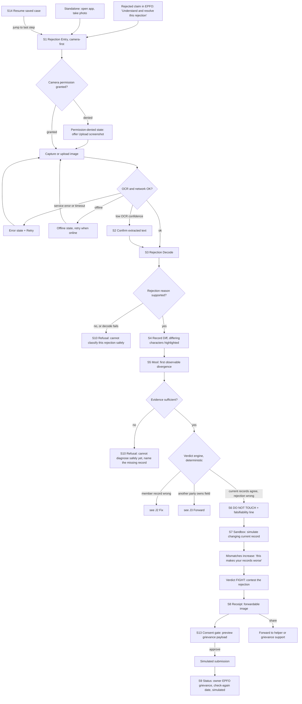
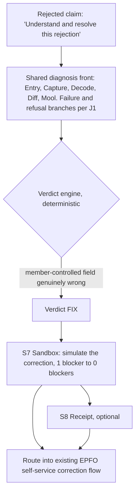
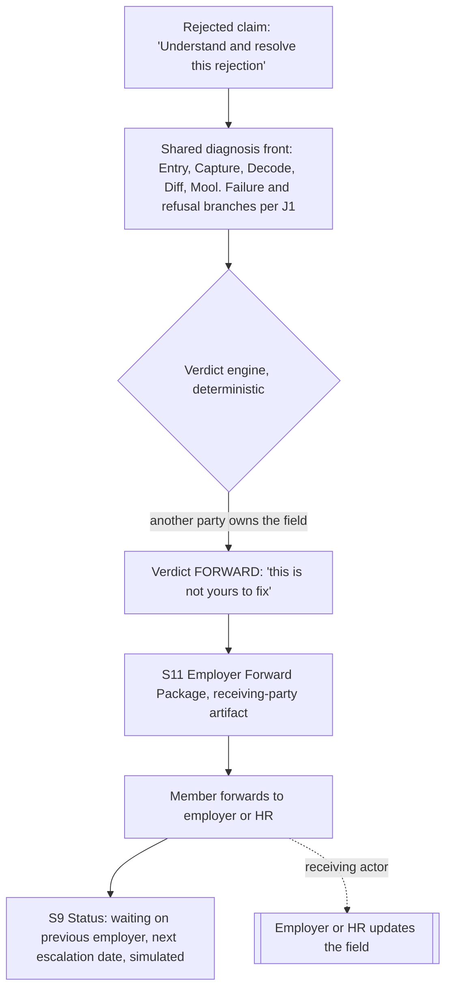
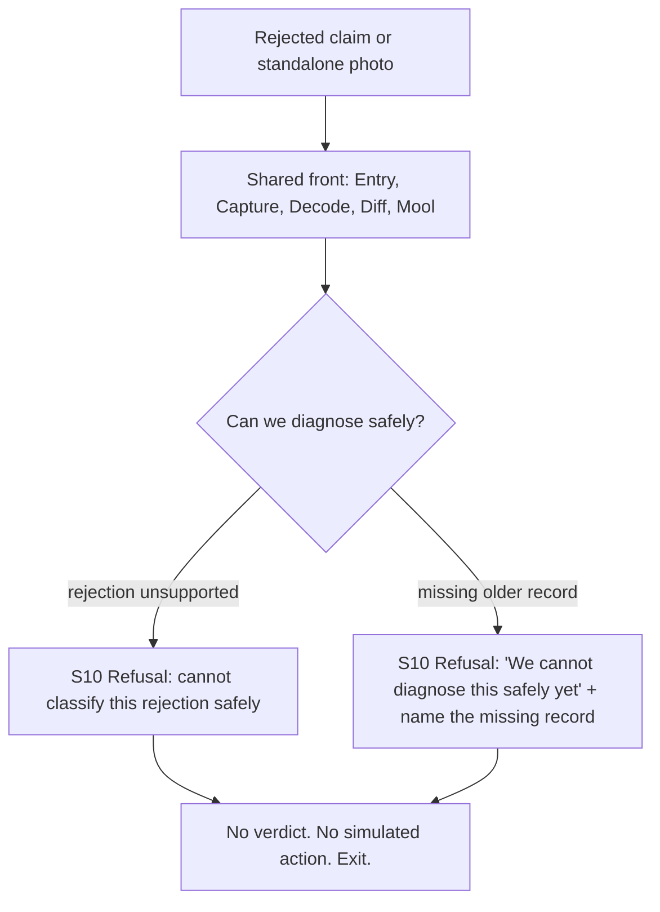
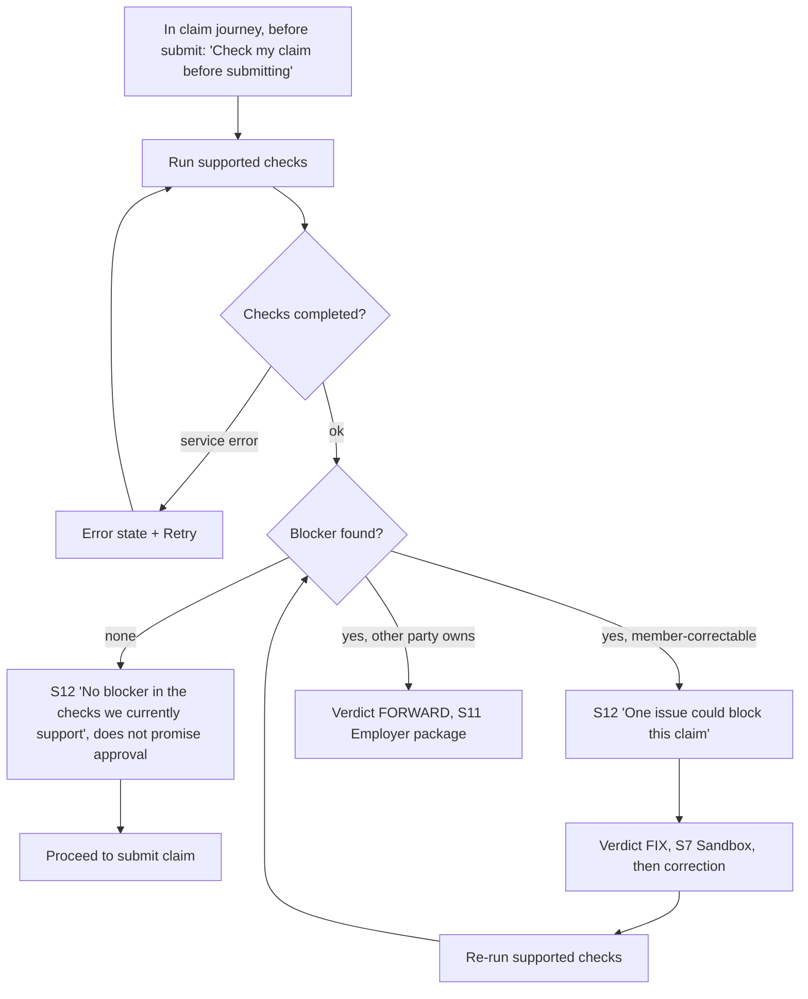

# Nidhi Rakshak — User Journeys

Source PRD: PRD.md (2026-08-26)

## Personas

**Rejected claimant (primary, hero MVP).** An EPFO member whose withdrawal claim has already been rejected and who cannot tell, on their own, what the rejection means or what to do next. Blue-collar or white-collar. We design for the harder context first: low-cost smartphone, limited EPFO familiarity, documents as photos not clean PDFs, preference for Hindi or code-mixed language, low confidence about which record is correct. They want their own money, not an EPFO education.

**Member before filing (secondary surface).** The same person, one step earlier. Has not filed yet and wants to catch a blocker before it becomes a rejection. Covered by the Pre-flight check.

**Trusted helper (secondary, out of MVP).** A relative, family member, or cyber-cafe operator navigating the process on the claimant's behalf. Useful, but Guardian/helper mode is P2 and gets no journey in this pass. Named here only so the receipt and handoff screens stay legible to a second reader.

**Employer / HR (receiving actor, not an app user).** The party a Forward case routes to. They never open Nidhi Rakshak, but they consume the Forward package, so it is designed for them to act without context.

## Journeys

Five end-to-end sessions. J1 to J4 are the frozen P0 golden cases for the rejected claimant, split by verdict because each is a genuinely different session that a given user experiences exactly one of. J5 is the P1 pre-filing surface. J1 carries the full shared diagnosis front-half and every failure branch in detail; J2 to J4 reference it and detail only their divergent tail.

Every screen shows a persistent "Simulated prototype, not EPFO" label. Progress is saved per case, so any journey can be re-entered from S14 and resumed at the last completed step.

---

### J1 — Rejected claimant: Fight (contest a wrong rejection)

**Entry points:** embedded, from a rejected claim in EPFO Member e-Sewa ("Understand and resolve this rejection", opens already in context); standalone prototype, open the app and photograph the rejection; resume, re-enter a saved in-progress case from S14.

**Steps:**

1. **Entry.** The member arrives from a rejected claim, or opens the standalone app. No login. If a saved case exists, they can resume it instead of starting over.
2. **Capture (S1).** Camera-first: "Take a photo of your rejection." Secondary CTA "Upload screenshot." *Branch, permission denied:* if the camera is blocked, show the permission-denied state and fall back to upload. No typing is required.
3. **Extract.** OCR reads the rejection text. *Branch, service error or timeout:* show an error state with Retry. *Branch, offline:* show the offline state and retry when the connection returns. *Branch, low confidence:* open S2 to let the member confirm the extracted text before proceeding.
4. **Decode (S3).** Map the rejection to a deterministic damage code and show a plain-language explanation, original text still visible. *Branch, unsupported or decode fails:* route to S10 Refusal, "we cannot classify this rejection safely." The system does not guess.
5. **Diff (S4).** Show the records side by side with the differing characters highlighted, each value carrying its source and verified/simulated/inferred state. CTA "Find where this starts."
6. **Mool (S5).** Show the chronological timeline and the first observable divergence, verified versus inferred kept distinct. "This is the first place your records stop agreeing." Where relevant, "we cannot see who entered this value." *Branch, insufficient evidence:* route to S10 Refusal, "we cannot diagnose this safely yet," naming the missing record.
7. **Verdict (engine).** Deterministic. For the Fight case the member's current records agree and the rejection looks wrong. *Off-ramps:* member-controlled record wrong goes to J2 Fix; another party owns the field goes to J3 Forward.
8. **Do Not Touch (S6).** Louder than the rest of the diagnosis: "DO NOT CHANGE YOUR CURRENT NAME. Your current records agree; changing them creates more mismatches." Includes the falsifiability line, for example "if your 2019 payslip also shows RAMESH, this diagnosis may be wrong."
9. **Sandbox (S7).** "What if I change my current EPFO name?" Simulate it, show mismatches rising from 1 to 2, recommend against the change. Never promises approval.
10. **Verdict FIGHT (S6).** One owner, one next action: contest the rejection with this evidence.
11. **Receipt (S8).** Generate a forwardable image summarizing issue, what we found, first divergence, what we do not know, verdict, do-not-do, falsifiability, next action, and the simulation label. Shareable to a helper or grievance support.
12. **Consent (S13).** Preview the exact grievance payload. Nothing is sent without explicit approval.
13. **Status (S9).** Owner is EPFO grievance; show a meaningful check-again date, marked simulated. No fake percentage.

**Exit states:** success, the member reaches Status with a contest route and a shareable receipt. Refusal, the session ends at S10 with no verdict and no simulated action. Abandonment, progress is saved per case; re-entry resumes from the last completed step via S14.

---

### J2 — Rejected claimant: Fix (correct my own record)

**Entry points:** same as J1 (embedded rejected claim, standalone photo, or resume). This journey is reached when the verdict engine finds a member-controlled field that is genuinely wrong, for example a wrong bank IFSC.

**Steps:**

1. **Shared front.** Entry through Mool exactly as J1, including the camera, OCR, decode, and refusal branches.
2. **Verdict FIX (S6).** The blocking field is member-correctable and the evidence supports the corrected value. One owner: the member.
3. **Sandbox (S7).** Simulate the correction, for example IFSC ABCD0001234 to ABCD0005678, and show supported blockers going from 1 to 0. "This correction clears the supported bank mismatch." It does not say the claim will now succeed.
4. **Receipt (S8), optional.** A forwardable summary if the member wants a record.
5. **Route.** Hand the member into the existing relevant EPFO self-service correction flow. Nidhi Rakshak identifies the route; it does not invent one.

**Exit states:** success, the member lands in the correct EPFO correction flow with the change validated in the sandbox first. Abandonment, saved and resumable.

---

### J3 — Rejected claimant: Forward (blocker owned by another party)

**Entry points:** same as J1. Reached when the verdict engine finds a field the member cannot correct, for example a missing Date of Exit owned by the previous employer.

**Steps:**

1. **Shared front.** Entry through diagnosis as J1. Diff and Mool establish that the field is missing or wrong and not member-controlled.
2. **Ownership.** State plainly which party owns the field, for example "this field is controlled by your previous employer."
3. **Verdict FORWARD (S6).** "This is not yours to fix." One owner: the employer or bank.
4. **Employer package (S11).** Generate a receiving-party artifact: employee, blocking field, current state, requested action, why it matters, supporting evidence, requested-by date, simulation label. Designed for the employer to act without re-diagnosis.
5. **Handoff.** The member forwards the package to the employer or HR.
6. **Status (S9).** "Waiting on previous employer," with a next escalation date. If no real escalation rule is supported, the date is simulated and labelled.

**Exit states:** success, a complete, forwardable employer package plus a tracker showing who owns the blocker and when to check again. The receiving actor acts outside the app. Abandonment, saved and resumable.

---

### J4 — Rejected claimant: Refusal (system safely refuses)

**Entry points:** same as J1. Reached whenever a supported diagnosis cannot be completed: the rejection reason is unsupported, or the evidence is insufficient to establish chronology.

**Steps:**

1. **Shared front.** Entry through capture and decode, and through diff and Mool where the flow gets that far.
2. **Refuse (S10).** Two triggers. Unsupported rejection reason: "we cannot classify this rejection safely." Insufficient evidence: "we cannot diagnose this safely yet," naming what is missing, for example "we need one older employment record to determine whether this mismatch existed before 2019."
3. **Stop.** No verdict, no invented Mool story, no simulated action.

**Exit states:** the session ends in a clearly explained refusal with a concrete next input. This is a trust behaviour, not an error. It is a required demo case: the product must prove it knows when not to answer.

---

### J5 — Member before filing: Pre-flight check (P1)

**Entry points:** inside the claim journey, before final submission: "Check my claim before submitting." This is a P1 secondary surface, included here because it runs the same supported checks earlier in the timeline.

**Steps:**

1. **Invoke.** Before submitting, the member taps "Check my claim before submitting."
2. **Run checks (S12).** Only the supported checks run. *Branch, service error:* error state with Retry.
3. **No issue.** "We found no blocker in the checks we currently support." It must not say the claim will be approved. The member proceeds to submit.
4. **Issue, member-correctable.** "We found one issue that could block this claim," for example a bank IFSC mismatch. Route through Verdict FIX and the sandbox, then re-run the checks.
5. **Issue, other party owns.** Route to Verdict FORWARD and the employer package, as in J3.

**Exit states:** success, either a clean pre-flight and submission, or a blocker fixed or forwarded before filing. The pre-flight never promises approval. Abandonment, saved and resumable.

---

## Story Traceability

The PRD is organized by prioritized features and flows rather than user stories, so each P-feature and each named flow is traced to the journeys that cover it. No orphans.

| Story (PRD feature / flow) | Journey(s) | Notes |
|---|---|---|
| P0.1 Camera-first rejection capture | J1, J2, J3, J4 | S1; permission, error, offline branches detailed in J1 |
| P0.2 Rejection Decode | J1, J2, J3, J4 | S3; unsupported reason routes to refusal |
| P0.3 Side-by-side Record Diff | J1, J2, J3, J4 | S4; provenance and verified/simulated state per field |
| P0.4 Mool, first divergence timeline | J1, J2, J3, J4 | S5; verified vs inferred; may trigger refusal |
| P0.5 Do Not Touch | J1 | S6, Fight state; louder than the rest |
| P0.6 Fix / Fight / Forward | J1, J2, J3 | Verdict engine; one verdict per session |
| P0.7 Falsifiability line | J1, J2, J3 | S6; one per supported verdict |
| P0.8 Try Before You Touch, sandbox | J1, J2, J5 | S7; never promises approval |
| P0.9 Forwardable case receipt | J1, J2 | S8; forwardable image is primary format |
| P0.10 Simulation / provenance labels | J1, J2, J3, J4, J5 | Global persistent label + per-field state chips |
| P0.11 Refusal state | J1, J4 | S10; unsupported reason or insufficient evidence |
| P1.1 Tap any field to hear it | J1, J2, J3, J4 | Audio layer over S4, S5, S6; P1, not in golden hero flow |
| P1.2 Pre-recorded audio for golden cases | J1, J2, J3, J4 | Demo infrastructure supporting P1.1; reduces live-API risk |
| P1.3 Claim Compiler / Pre-flight check | J5 | S12 |
| P1.4 Consent + simulated execution | J1, J3 | S13 in J1; the handoff in J3 is also consent-gated |
| P1.5 Employer-oriented Forward package | J3, J5 | S11 |
| Flow 1 Fight | J1 | Hero path |
| Flow 2 Forward | J3 | |
| Flow 3 Fix | J2 | |
| Flow 4 Pre-flight | J5 | |
| Flow 5 Refusal | J4 | Required demo case |
| P2 items (Guardian mode, real WhatsApp/SMS/IVR, Prove-It-Back, persistent readiness, nominee/Virasat, cohort intelligence, and the rest) | none | Explicitly future / out of MVP; no journey this pass |

## Screen Inventory

Handoff surface for wireframing. One entry per screen the journeys imply. Every screen also carries the global "Simulated prototype, not EPFO" label.

### S1 — Rejection Entry
**Purpose:** start from the artifact the member already has. **Appears in:** J1, J2, J3, J4.
**Contents:** primary CTA "Take a photo of your rejection," secondary "Upload screenshot," image preview, extracted-text readout, simulation label. No required typing.

| State | Behavior |
|---|---|
| Loading | Camera initializing / image uploading spinner |
| Empty | No image yet; show the two capture CTAs |
| Error | Upload or OCR service failure; message + Retry. Offline variant: "you are offline," retry when connection returns |
| Permission denied | Camera blocked; show reason and fall back to Upload screenshot |

### S2 — Confirm Extracted Text
**Purpose:** let the member confirm OCR output when confidence is low, before diagnosis. **Appears in:** J1, J2, J3, J4 (conditional).
**Contents:** extracted rejection text, original image thumbnail, confirm action, minimal tap-to-correct. Shown only when extraction confidence is low.

| State | Behavior |
|---|---|
| Loading | Extracting text |
| Default | Show extracted text for confirmation |
| Error | Extraction failed; Retry or re-upload |

### S3 — Rejection Decode
**Purpose:** turn the rejection into one plain-language explanation. **Appears in:** J1, J2, J3, J4.
**Contents:** plain-language explanation (English/Hindi where supported), original rejection text kept visible, internal damage code not shown to the member.

| State | Behavior |
|---|---|
| Loading | Mapping rejection to damage code |
| Default | Explanation + original text |
| Unsupported | Reason cannot be classified; route to S10 Refusal |

### S4 — Record Diff
**Purpose:** make the disagreement visually obvious. **Appears in:** J1, J2, J3, J4.
**Contents:** side-by-side sources and values, differing characters highlighted, per-field source, raw and normalized value, verification and simulated/inferred state. CTA "Find where this starts."

| State | Behavior |
|---|---|
| Loading | Fetching and normalizing records |
| Empty | No comparable records available; route to S10 Refusal |
| Error | Record fetch failure; Retry |
| Default | Highlighted diff with provenance chips |

### S5 — Mool
**Purpose:** show the first observable divergence. **Appears in:** J1, J2, J3, J4.
**Contents:** chronological timeline, first divergence visually dominant, verified vs inferred distinct, "this is the first place your records stop agreeing," and where relevant "we cannot see who entered this value." No unsupported blame.

| State | Behavior |
|---|---|
| Loading | Building timeline |
| Default | Timeline with first divergence highlighted |
| Low confidence | Evidence insufficient; route to S10 Refusal |

### S6 — Verdict / Do Not Touch
**Purpose:** prevent harmful action and give one next route. **Appears in:** J1 (Fight), J2 (Fix), J3 (Forward).
**Contents:** the verdict, one clear owner, one next action, one falsifiability line, sandbox CTA, receipt CTA. Fight adds a loud "do not change" prohibition above the verdict.

| State | Behavior |
|---|---|
| Fight | DO NOT TOUCH prohibition + FIGHT + falsifiability |
| Fix | FIX + corrected value + sandbox CTA |
| Forward | FORWARD + owning party + package CTA |

### S7 — Sandbox
**Purpose:** show the consequence before the member acts. **Appears in:** J1, J2, J5.
**Contents:** proposed change, before state, after state, supported-blocker count, a clear recommendation. Never guarantees approval.

| State | Behavior |
|---|---|
| Loading | Recomputing supported checks |
| Default | Before/after with blocker counts and recommendation |
| Error | Recompute failed; Retry |

### S8 — Receipt / Handoff
**Purpose:** carry the diagnosis to the next actor. **Appears in:** J1, J2 (optional).
**Contents:** forwardable image; issue, what we found, first divergence, what we do not know, verdict, do-not-do, falsifiability, next action, simulation label. Minimal text.

| State | Behavior |
|---|---|
| Loading | Generating the image |
| Default | Forwardable image + share action |
| Error | Generation failed; Retry |

### S9 — Status / Tracker
**Purpose:** answer who owns the blocker and when to check again. **Appears in:** J1, J3.
**Contents:** current owner, a meaningful next date. No fake percentage. Dates are real where supported, otherwise labelled simulated.

| State | Behavior |
|---|---|
| Default | Owner + next date, e.g. "waiting on previous employer, check again by 2 September" |
| Simulated date | Date shown with a simulated label when no real rule supports it |

### S10 — Refusal
**Purpose:** stop safely when the product cannot diagnose. **Appears in:** J1, J4.
**Contents:** what is missing, the concrete next input needed. No verdict, no simulated action.

| State | Behavior |
|---|---|
| Unsupported rejection | "We cannot classify this rejection safely" |
| Insufficient evidence | "We cannot diagnose this safely yet" + names the missing record |

### S11 — Employer Forward Package
**Purpose:** give the receiving party enough to act without re-diagnosis. **Appears in:** J3, J5.
**Contents:** employee, blocking field, current state, requested action, why it matters, supporting evidence, requested-by date, simulation label.

| State | Behavior |
|---|---|
| Loading | Generating the package |
| Default | Complete forwardable employer artifact |
| Error | Generation failed; Retry |

### S12 — Pre-flight Entry + Result
**Purpose:** run supported checks before filing. **Appears in:** J5.
**Contents:** invoke CTA "Check my claim before submitting," result copy for issue vs clear. Clear result never promises approval.

| State | Behavior |
|---|---|
| Loading | Running supported checks |
| Result, clear | "No blocker in the checks we currently support"; proceed to submit |
| Result, issue | "One issue could block this claim"; route to Fix or Forward |
| Error | Checks failed to run; Retry |

### S13 — Consent / Simulated Execution
**Purpose:** require explicit approval before any outbound action. **Appears in:** J1.
**Contents:** full payload preview (claim number, rejection reason, evidence, Mool timeline, verdict, requested action), explicit approve action.

| State | Behavior |
|---|---|
| Default | Payload preview + approve |
| Post-approve | Simulated-submission confirmation; never claims a real filing occurred |

### S14 — Resume / Case list
**Purpose:** re-enter a saved case and resume at the last completed step. **Appears in:** all journeys (re-entry).
**Contents:** list of in-progress cases with the last completed step, resume action, start-new action.

| State | Behavior |
|---|---|
| Empty | No saved cases; offer start-new |
| Default | List of saved cases with last step and resume |
| Error | Failed to load saved cases; Retry |

## Decisions

| # | Question | Answer | Date |
|---|---|---|---|
| 1 | Auth / entry in the prototype | No auth gate. The prototype opens directly into the flow, embedded from a simulated rejected claim or as a standalone photo. Resolved from the non-goals (no live EPFO login, all data simulated). *(deferred to skill)* | 2026-08-26 |
| 2 | Technical / system failure handling | Design each failure branch: camera permission denied, image upload or OCR service error, network offline. Inline in diagrams where they redirect the user; per-screen states in the matrix. | 2026-08-26 |
| 3 | Abandonment and return behavior | Persist progress per case and resume from the last completed step. Added S14 Resume / Case list as the re-entry surface. | 2026-08-26 |
| 4 | Pre-flight scope | Include Pre-flight as a journey (J5), marked P1, alongside the P0 golden cases (Fight, Forward, Fix, Refusal). | 2026-08-26 |
